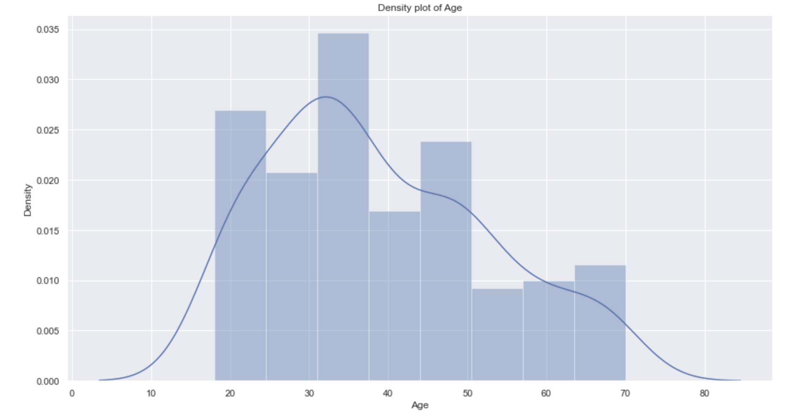

# Customer Segmentation
## Objective
Customer segmentation is done to divide customers into different clusters so that a business can tailor their marketing campaigns for each different cluster. 
## Code and Resources Used

Python version: 3.8

Packages used: pandas, matplotlib, seaborn, dabl, sklearn

Data source: https://www.kaggle.com/vjchoudhary7/customer-segmentation-tutorial-in-python

## Data

Then dataframe contains five columns:
- CustomerID
- Age
- Gender
- Annual Income (k$)
- Spending score (1-100)

Spending score is the score given to customers by the mall based on how much they spent in the mall. The more a customer spends, the higher his spending score.

## Exploratory Data Analysis

![Density Plot of Income][Income_DensityPlot.png]
![Histogram of Spending Score][SpendingScore_Histogram.png]
![Income Distribution by gender][Income_Gender.png]
![Spending Score Distribution by gender][SpendingScore_Gender.png]

## Customer Segmentation
The purpose of customer segmentation is to divide the customers based on thier age, income and spending score using an unsupervised machine learning algorithm called k-Means Clustering. To find the optimal number of clusters, the elbow method has been used. 

The results of clustering are as follows:

